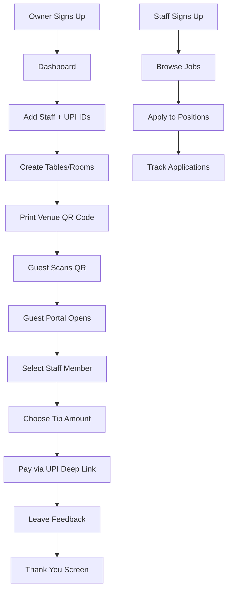

<p align="center">
  
</p>

<h1 align="center">🍽️ DineCrew</h1>

<p align="center">
  <strong>The Unified Management & Tipping Platform for Modern Hospitality</strong>
</p>

<p align="center">
  <a href="#features">Features</a> •
  <a href="#tech-stack">Tech Stack</a> •
  <a href="#architecture">Architecture</a> •
  <a href="#getting-started">Getting Started</a> •
  <a href="#database-schema">Database</a> •
  <a href="#deployment">Deployment</a> •
  <a href="#license">License</a>
</p>

<p align="center">
  
  
  
  
  
</p>

---

## 💡 What is DineCrew?

**DineCrew** is a full-stack hospitality operations platform that enables restaurants, cafés, and hotels to manage staff, collect guest feedback, facilitate **zero-fee direct UPI tipping**, and hire talent — all from a single dashboard.

Guests scan a **single venue QR code** placed at a table or room. No app download required — everything works instantly in the browser.

### The Problem

- Staff tips are lost in cash or pooled unfairly
- Guest feedback is scattered across Google, Zomato, and Swiggy
- Hiring hospitality talent is fragmented and expensive
- Venue owners lack real-time visibility into operations

### The Solution

DineCrew unifies tipping, feedback, staff management, and talent hiring into one platform with **0% commission** on tips — payments go directly from guest to staff via UPI.

---

## ✨ Features

### 🏢 For Restaurant & Hotel Owners

| Feature | Description |
|---|---|
| **Dashboard** | Real-time overview of tips, reviews, and staff performance |
| **Staff Management** | Add, edit, and manage waiters, chefs, managers, hosts, and bartenders |
| **Table/Room Management** | Create tables or hotel rooms and assign staff to them |
| **QR Code Generation** | Auto-generated venue QR code — one QR for the entire venue |
| **Guest Reviews** | View all guest feedback with sentiment analysis |
| **Analytics** | Track tip trends, review sentiment, and staff performance over time |
| **Job Postings** | Post hospitality job openings and manage applications |
| **Business Settings** | Configure venue name, address, currency, and branding |

### 📱 For Guests (No Login Required)

| Feature | Description |
|---|---|
| **QR Scan → Instant Portal** | Scan the venue QR and access the tipping/feedback portal instantly |
| **Staff Selection** | Browse the venue's team with photos, roles, and ratings |
| **Direct UPI Tipping** | Tap to tip any amount — opens the guest's UPI app directly |
| **Anonymous Feedback** | Leave private feedback with sentiment (😊 😐 😞) for the venue |
| **Zero Friction** | No downloads, no signups, no accounts — just scan and go |

### 👔 For Hospitality Staff (Job Seekers)

| Feature | Description |
|---|---|
| **Job Marketplace** | Browse and apply to open hospitality positions |
| **Application Tracking** | Track the status of all submitted applications |
| **Profile Management** | Build a professional hospitality profile with skills and experience |

---

## 🛠️ Tech Stack

| Layer | Technology |
|---|---|
| **Framework** | [Next.js 16](https://nextjs.org/) (App Router, Server Components) |
| **Frontend** | [React 19](https://react.dev/), CSS Modules |
| **Backend/Auth** | [Supabase](https://supabase.com/) (PostgreSQL, Auth, Row Level Security) |
| **Payments** | UPI Deep Links (`upi://pay`) — zero commission, P2P direct |
| **OTP Verification** | Custom OTP microservice on Vercel |
| **Deployment** | [Vercel](https://vercel.com/) |
| **Design System** | Custom CSS variables, Inter font, responsive-first |

---

## 🏗️ Architecture

```
dinecrew/
├── public/                    # Static assets
├── src/
│   ├── app/
│   │   ├── page.js            # Landing page
│   │   ├── login/             # Sign-in (auto-detects role)
│   │   ├── register/          # Registration with OTP verification
│   │   ├── dashboard/         # Business owner dashboard
│   │   │   ├── staff/         # Staff CRUD
│   │   │   ├── tables/        # Table/Room management + QR
│   │   │   ├── reviews/       # Guest feedback viewer
│   │   │   ├── analytics/     # Charts and trends
│   │   │   ├── jobs/          # Job posting management
│   │   │   └── settings/      # Venue settings
│   │   ├── staff/             # Staff member portal
│   │   │   ├── jobs/          # Job marketplace browser
│   │   │   └── profile/       # Staff profile editor
│   │   ├── r/[slug]/          # Guest portal (public, no auth)
│   │   │   └── [table]/       # Table-specific guest view
│   │   └── globals.css        # Design tokens & reset
│   ├── components/
│   │   └── GuestPortal.js     # Multi-step guest tipping/feedback flow
│   ├── lib/
│   │   ├── supabase-browser.js
│   │   └── supabase-server.js
│   └── middleware.js           # Auth session refresh
└── supabase/
    └── migrations/            # Database schema (SQL)
```

### User Flows



---

## 🚀 Getting Started

### Prerequisites

- **Node.js** ≥ 18
- **npm** or **yarn**
- A **Supabase** project ([create one free](https://supabase.com/dashboard))

### 1. Clone the Repository

```bash
git clone https://github.com/umeshadabala/DineCrew.git
cd DineCrew
```

### 2. Install Dependencies

```bash
npm install
```

### 3. Configure Environment Variables

Create a `.env.local` file in the project root:

```env
NEXT_PUBLIC_SUPABASE_URL=https://your-project.supabase.co
NEXT_PUBLIC_SUPABASE_ANON_KEY=your-supabase-anon-key
```

> ⚠️ **Important:** Use the **anon/public** key from your Supabase project settings, not the service role key.

### 4. Set Up the Database

Run the migration files in order in the **Supabase SQL Editor**:

```sql
-- Run these in order:
-- 1. supabase/migrations/001_schema.sql
-- 2. supabase/migrations/002_dinecrew_schema.sql
```

This creates all tables (`businesses`, `staff_profiles`, `tables`, `tips`, `reviews`, `job_postings`, `job_applications`) with Row Level Security policies.

### 5. Start the Dev Server

```bash
npm run dev
```

Open [http://localhost:3000](http://localhost:3000) in your browser.

---

## 🗄️ Database Schema

DineCrew uses **Supabase (PostgreSQL)** with the following core tables:

| Table | Purpose |
|---|---|
| `businesses` | Venue profiles (restaurants, hotels) linked to owner accounts |
| `staff_profiles` | Staff members with roles, UPI IDs, skills, and experience |
| `tables` | Tables/rooms within a venue, with optional staff assignment |
| `tips` | Tip transaction records (amount, staff, guest metadata) |
| `reviews` | Guest feedback with sentiment and star ratings |
| `job_postings` | Hospitality job listings created by venue owners |
| `job_applications` | Staff applications to job postings with status tracking |

All tables have **Row Level Security (RLS)** enabled — owners can only see their own data, staff can only see their own profiles and applications.

---

## 🌐 Deployment

### Deploy to Vercel (Recommended)

[](https://vercel.com/new/clone?repository-url=https://github.com/umeshadabala/DineCrew)

1. Push the repo to GitHub
2. Import the project in [Vercel](https://vercel.com)
3. Add environment variables (`NEXT_PUBLIC_SUPABASE_URL`, `NEXT_PUBLIC_SUPABASE_ANON_KEY`)
4. Deploy — Vercel auto-detects Next.js

### Build for Production

```bash
npm run build
npm start
```

---

## 📱 Guest Portal — How It Works

1. **Owner** prints their venue QR code from the dashboard
2. **Guest** scans the QR at their table using any camera app
3. The browser opens `yourdomain.com/r/venue-slug` — no app needed
4. Guest selects their waiter → picks a tip amount → taps **Pay with UPI**
5. The phone's UPI app (Google Pay, PhonePe, Paytm) opens pre-filled
6. Payment goes **directly to the staff member's UPI ID** — **0% fees**
7. Guest optionally leaves private feedback for the venue

---

## 🔐 Authentication

- **Registration**: Email + OTP verification → Supabase Auth sign-up
- **Login**: Email/password with auto-role detection (redirects to `/dashboard` for owners, `/staff` for staff)
- **Guest Portal**: Fully public — no login required
- **Duplicate Detection**: Registering with an existing email shows an instant redirect dialog to sign in

---

## 🤝 Contributing

Contributions are welcome! To get started:

1. Fork this repository
2. Create a feature branch: `git checkout -b feature/my-feature`
3. Commit your changes: `git commit -m "Add my feature"`
4. Push to the branch: `git push origin feature/my-feature`
5. Open a Pull Request

---

## 📄 License

This project is licensed under the **MIT License** — see the [LICENSE](LICENSE) file for details.

---

## 👤 Author

**Umesh Adabala**

- GitHub: [@umeshadabala](https://github.com/umeshadabala)

---

<p align="center">
  Built with ❤️ for the hospitality industry
</p>
